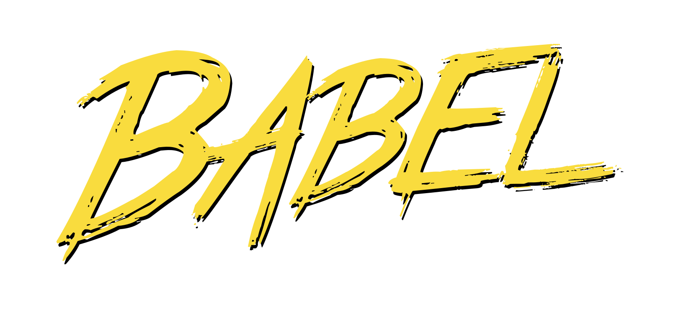

<h1 align="center">Hi 👋, I'm Maciel Alves</h1>
<h2 align="left">Languages and Tools:</h2>

 
 
 
 
 
 

I'm a self-taught student who transforms knowledge into practice through projects like the Beneficent Association and Human Development. Determined to learn from challenges, I strive to go beyond Front-end development to always know a bit more, as I'm convinced that curiosity, continuous learning, teaching, and disciplined execution make me a promising candidate to integrate and contribute significantly to a development team.

